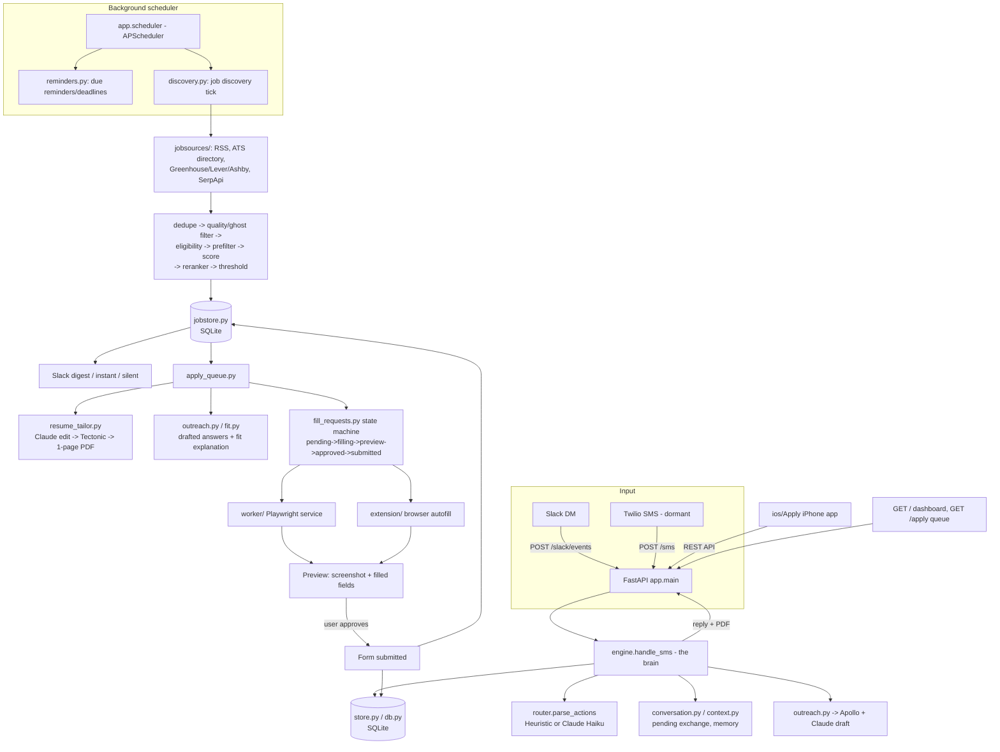

# Job Search Intelligence

A personal, conversational job-search engine: chat with it on Slack, and it discovers jobs, ranks them against your taste, drafts full applications (tailored resume + answers), and — after you approve — fills and submits them.

## What this is

This is not a SaaS product; it's a single-user tool built to run one person's job search on autopilot as much as possible while keeping every irreversible step under human control.

At its core it's a chat bot you text naturally — "applied spotify swe ii", "spotify oa received", "what should I follow up on" — and it logs applications, updates their status, takes notes, tracks deadlines, and tells you who to follow up with. Slack is the primary way you talk to it (a dormant SMS/Twilio path also exists), and it holds a real multi-turn conversation: it remembers what it just asked you and can hold a back-and-forth instead of treating every message in isolation.

On top of that tracking layer, it also goes out and **finds jobs for you**. Once you tell it what you're looking for ("new grad SWE roles, remote or NYC"), a background loop continuously scans RSS feeds, a rotating directory of ~60 public company job boards, and (optionally) a paid Google Jobs search, scores each posting against your profile and your own past swipe/apply behavior, and alerts you to the best matches — usually as one digest message rather than a firehose.

When you want to apply, it prepares the whole application: a resume tailored to that specific role (compiled from a LaTeX template, trimmed to one page), a drafted "why I'm a fit" note, and answers to any free-text application questions, all generated with an LLM. You can then have it filled into the real application form for you — via a browser extension on desktop, a headless worker driven from your phone, or an iPhone app that's really a smart in-app browser — but it **never submits anything without your explicit approval**. You always see a preview of exactly what was filled before it goes out.

In short: it is a job-search co-pilot that remembers everything, finds roles you'd otherwise miss, does the tedious application-prep work, and asks permission before anything irreversible happens.

## Key features

- **Conversational tracker** — log/update/note/query applications by texting naturally; multi-turn slot filling, confirmations, corrections, undo, and bulk operations.
- **Two intent routers** — a free, fully offline heuristic (regex) router, and an optional Claude (Haiku 4.5) router for richer natural-language understanding, with automatic fallback to the offline router on any API/rate-limit error.
- **Job discovery** — background polling of RSS feeds, an ATS board directory (Greenhouse/Lever/Ashby), and an optional paid Google Jobs (SerpApi) search; dedupe, ghost-job filtering, eligibility filtering, and relevance scoring before anything reaches you.
- **Personalized ranking** — a lightweight logistic-regression re-ranker trained on your own apply/dismiss/swipe decisions, refining the base relevance score over time.
- **Deadline & reminder tracking** — natural-language deadlines ("stripe oa due friday") and reminders, delivered via Slack (or SMS/log as fallback) through an in-process scheduler.
- **Recruiter outreach** — free Apollo people-search lookups per company, with drafted intro messages (Claude); you copy/paste, nothing is auto-sent.
- **Resume tailoring** — Claude edits a base LaTeX resume for the specific role, Tectonic compiles it to a one-page PDF, and results are cached per company/role.
- **Assisted, approval-gated apply** — a browser extension, a headless Playwright worker, and an iOS app can all fill (and, only after you tap approve, submit) public Greenhouse/Lever/Ashby forms, sharing one rules engine so behavior never drifts between surfaces.
- **Read-only web dashboard** — pipeline stats, a funnel, follow-up priorities, upcoming deadlines, and discovered matches.

## How it works

The system has two loops that share the same data store: the **conversation loop** (you talking to the bot) and the **discovery/apply loop** (the bot finding and preparing jobs for you).

1. **Message in.** A Slack DM (or, dormant, an SMS) hits `POST /slack/events` in the FastAPI app. The signature is verified, the event is deduped/loop-guarded, and the raw text is handed to `engine.handle_sms(user, text)` — the same "brain" function regardless of which transport it came from.
2. **Intent parsing.** `router.parse_actions()` turns the text into one or more structured actions. Without an `ANTHROPIC_API_KEY` this is a regex-based heuristic router running fully offline; with the key set, it switches to Claude Haiku 4.5 (structured JSON output, prompt caching, rate-limited, and it silently falls back to the heuristic router on any failure).
3. **Conversation state.** `conversation.py` and `context.py` track any pending multi-turn exchange (e.g. the bot asked "role, name, or date?") and per-user memory (last company/role/application), so replies resolve against what was just discussed.
4. **Execution.** `engine.py` fills in missing slots, asks clarifying questions, confirms destructive actions, and executes the action(s) against `store.py` (SQLite via `db.py`). Every state change writes an event row, so full history is preserved and single-level undo is possible.
5. **Reply out.** The engine's response text (and any resume PDF attachment) goes back out through `slack.py`.

In parallel, a background scheduler (`app/scheduler.py`, APScheduler) runs two independent poll loops:

- **Reminders/deadlines** — checks for anything due and delivers it through the same Slack/SMS sender used for chat replies.
- **Job discovery** (`app/discovery.py`) — for each user with a profile set, it pulls candidate postings from RSS feeds, the rotating ATS board directory, and (optionally) SerpApi; dedupes against everything already seen; runs a free keyword/location pre-filter; filters ghost jobs and ineligible postings; scores survivors 0–1 (Claude Haiku, or a free heuristic without a key), refined by the personalized re-ranker; and queues anything above the user's relevance threshold. Depending on `JOB_ALERT_MODE`, you get one digest message, one message per job, or a silent queue.

From there, an **apply** flow takes over: `apply <#>` (or the `/apply` web queue, or the iOS app) triggers `resume_tailor.py` to pick a resume base, have Claude edit it for the role, compile it with Tectonic, and trim it to one page; `outreach.py`/`fit.py` draft the "why I'm a fit" note and per-question answers. To actually fill the live form, the request goes into `fill_requests.py`'s state machine (`pending → filling → preview → approved → submitting → submitted`); either the browser extension or the separate `worker/` service (headless Playwright, sharing `app/fieldmatch.py`'s field-matching rules) fills the form and reports back a screenshot preview. Nothing submits until the user approves the preview — in Slack, on the `/apply` web page, or in the iOS app.



## Tech stack

- **Backend:** Python 3.13, FastAPI, Uvicorn, SQLite (via a thin `db.py` wrapper with idempotent migrations)
- **Scheduling:** APScheduler (in-process poll loops for reminders and job discovery)
- **LLM:** Anthropic Claude (Haiku 4.5 for routing/scoring/drafting, configurable; Opus for the harder worker-agent fill decisions), via the `anthropic` SDK with structured outputs and prompt caching
- **Messaging transports:** Slack Events/Web API (primary), Twilio SMS (dormant)
- **Recruiter data:** Apollo.io people-search API
- **Job sources:** RSS (feedparser-style parsing), Greenhouse/Lever/Ashby public APIs, an internal ATS board directory, optional SerpApi Google Jobs search
- **Resume generation:** LaTeX (`resumes/*.tex`) compiled with Tectonic, page-counted with `pypdf`
- **Browser automation (worker):** Playwright (headless Chromium)
- **Browser extension:** vanilla JS content script (Manifest V3), targeting Greenhouse, Lever, Ashby, Workday, iCIMS, SmartRecruiters, Workable, BambooHR
- **Mobile:** native iOS app in SwiftUI + WKWebView, project generated with XcodeGen
- **Push notifications:** APNs via PyJWT/cryptography (ES256-signed bearer tokens), HTTP/2 via `httpx`+`h2`
- **Testing:** pytest (~350+ offline tests; live API keys are neutralized in `conftest.py`)
- **Deployment:** Docker + Fly.io, persistent volume for SQLite, one always-warm machine so the scheduler keeps ticking

## Project structure

```
app/                Core FastAPI application (the "brain" + all subsystems)
  main.py              FastAPI routes: dashboard, Slack/Twilio/JSON webhooks, /apply/* API, /health
  engine.py            Conversation brain: slot filling, confirmations, undo, actions
  router.py            Intent extraction (HeuristicRouter + AnthropicRouter)
  conversation.py      Pending-exchange state, yes/no/correction/smalltalk handling
  context.py           Per-user short-term memory
  store.py / db.py     Application persistence + SQLite schema/migrations
  intents.py           Intent enum, ParsedMessage, canonical statuses
  scoring.py           Follow-up prioritization
  reminders.py / deadlines.py / scheduler.py   Reminders, deadlines, background poll loop
  apollo.py / outreach.py   Recruiter discovery + drafted intros
  discovery.py / wide_discovery.py / jobstore.py / matcher.py / quality.py / eligibility.py
                       Job discovery pipeline: sourcing, dedupe, filtering, scoring
  jobsources/          Per-source adapters: RSS, ATS directory, Greenhouse, Lever, Ashby, aggregator
  reranker.py / embeddings.py / trainer.py / insights.py   Personalized ML re-ranking + swipe trainer
  resume_tailor.py / resume_store.py   Tailored resume generation + caching
  apply_queue.py / fill_requests.py / fieldmatch.py / ats.py   Assisted-apply pipeline + shared fill rules
  applicant.py / knowledge.py / profile.py   Identity, durable facts, match profile
  dashboard.py         Read-only HTML dashboard
  push.py / slack.py   APNs push, Slack transport
worker/              Standalone Playwright service that fills and (post-approval) submits forms
extension/           Browser extension (autofill on live ATS pages)
ios/Apply/           Native iOS app (SwiftUI) — mobile apply queue, in-flight approvals, autofill
cli.py               Local REPL / one-shot CLI, bulk import, agenda view
scripts/             Maintenance/one-off scripts (backfills, migrations, experiments)
tests/               ~350+ offline pytest tests, incl. fixture-driven form-fill tests
resumes/             Base LaTeX resumes (not committed — personal data)
data/ats_boards.json Directory of public ATS boards used by wide discovery
deploy/              Fly.io deployment notes
```

## Setup / running locally

Requires Python 3.12 or 3.13 (not 3.14 — `pydantic-core` has no wheels for it yet).

```bash
python3.13 -m venv .venv
.venv/bin/pip install -r requirements.txt
cp .env.example .env          # optional; defaults work with no API keys

# Talk to it locally, exactly like the messaging channel:
.venv/bin/python cli.py
.venv/bin/python cli.py "applied spotify swe ii"
.venv/bin/python cli.py import apps.csv   # bulk backfill
.venv/bin/python cli.py agenda            # upcoming deadlines

# Run the web service (dashboard, webhooks, /apply API):
.venv/bin/uvicorn app.main:app --reload --port 8000

# Run the test suite (fully offline, no live API calls):
.venv/bin/python -m pytest -q
```

With no `ANTHROPIC_API_KEY` set, everything runs on free, offline heuristics (intent routing, job scoring). Setting `ANTHROPIC_API_KEY` switches routing/scoring/drafting to Claude Haiku 4.5 automatically. Setting `SLACK_BOT_TOKEN` + `SLACK_SIGNING_SECRET` makes Slack the active reminder/reply channel; `APOLLO_API_KEY` enables recruiter discovery; `SERPAPI_API_KEY` + `JOB_WIDE_AGGREGATOR_ENABLED=true` enable the paid Google Jobs source. See `.env.example` for the full list.

To run the submit worker or the browser extension/iOS app locally, see their own READMEs: [`worker/README.md`](worker/README.md), [`extension/README.md`](extension/README.md), [`ios/README.md`](ios/README.md). For deploying the main app, see [`deploy/README.md`](deploy/README.md).

## Notable implementation details / design decisions

- **Transport-agnostic brain.** `engine.handle_sms(user, text)` is the single entry point for Slack, SMS, the CLI, and the JSON `/message` endpoint — the routing/conversation/execution logic doesn't know or care which channel it's talking through.
- **Cost-conscious LLM usage.** The Claude router defaults to the cheapest capable model (Haiku 4.5), uses structured JSON outputs to guarantee parseable responses, caches the static system prompt, caps tokens and input length, rate-limits paid calls with a token bucket, and falls back to a free heuristic on any error rather than failing the request. `/health` reports cumulative token usage.
- **Approval is never skippable for irreversible actions.** Deletes and bulk changes are two-step (show consequence, act only on explicit "yes"); undo is single-level and explicitly refuses to undo a delete; and no application is ever auto-submitted — every fill produces a preview (screenshot + field list) that a human must approve.
- **One shared field-matching engine, three surfaces.** `app/fieldmatch.py` is the single source of truth for which form fields get autofilled and which are refused (notably EEO/demographic questions, which are never filled by design). The browser extension, the iOS app, and the Playwright worker all consume the same rules (fetched live via `/apply/rules`, with tests asserting the iOS bundled fallback can't drift from the backend).
- **Cost-gated job discovery.** Free sources (RSS, ATS directory) run before any paid lookup; postings are pre-filtered on cheap keyword/location checks before ever reaching the LLM scorer, batched into one call per tick, and capped per day; each posting is scored and alerted exactly once via a dedupe key.
- **Personalization without a large model.** The re-ranker (`reranker.py`) is a small, dependency-free logistic regression trained on the user's own labeled decisions (apply/dismiss/swipe), layered on top of the base relevance score rather than replacing it.
- **Everything is auditable.** Every application status change writes an `application_events` row with the raw triggering message, so history is never silently overwritten — it's the basis for undo and for the dashboard's per-app timeline.
- **Deployment is deliberately single-instance.** Reminders and discovery run as in-process poll loops, so the Fly.io config keeps exactly one warm machine (not autoscaled) to avoid duplicate reminders and split SQLite state; SQLite lives on a persistent volume, not the ephemeral image.
